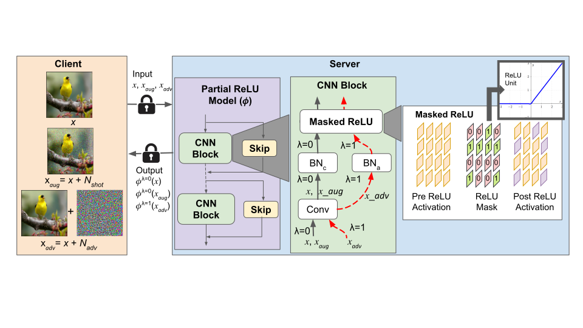

# RLNet: Robust Linearized Networks for Efficient Private Inference

<p align="center"> 
    
</p> 

The training is performed in 3 stages: 

1. Train a teacher model

```
python train_teacher.py --model='ResNet18' --dataset='cifar10' --augment_mode='augmix' --attack_mode='pgd' --use2BN
```

2. Train stage-1: ReLU mask identification

Training with natural images:
```
python train_student_stage1_multigpu.py --path_t='save/models/CIFAR10/ResNet18_best.pth' --gamma=0.5 --alpha=0.5 --beta=1000 --model_s='CustomResNet18' --dataset='cifar10' --distill='kd' --sensitivity='ResNet18_C10_relu82k_sensitivity'
```
Dual-BN training:
```
CUDA_VISIBLE_DEVICES=2 python train_student_stage1_multigpu.py --path_t='save/models/ResNet18_cifar10_augmix_pgd_2BN_batch128/ResNet18_best_TA0.0.pth' --gamma=0.5 --alpha=0.5 --beta=1000 --model_s='CustomResNet18' --dataset='cifar10' --distill='kd' --sensitivity='ResNet18_c100_relu82k_sensitivity' --attack_mode='pgd' --steps=7 --kd_T=4 --robust_train_mode='rslad+ce' --augment_mode='augmix' --use2BN 
```
Multi-GPU training:
```
CUDA_VISIBLE_DEVICES=1,2 python -m torch.distributed.launch --nproc_per_node=2 --master_port=29500 train_student_stage1_multigpu.py --path_t='save/models/CIFAR10/ResNet18_best.pth' --gamma=0.5 --alpha=0.5 --beta=1000 --model_s='CustomResNet18' --dataset='imagenet' --distill='kd' --sensitivity='ResNet18_imagenet_relu300k_sensitivity' --t1_epochs=90 --learning_rate=0.01 --lr_decay_epochs='50,80'
```

3. Train stage-2: Fine-tuning with fixed ReLU mask
Training with natural images:
```
python train_student_stage2_multigpu.py --dataset='cifar10' --path_t='save/models/CIFAR10/ResNet18_best.pth' --gamma=0.1 --alpha=0.5 --beta=1000 --model_s='CustomResNet18' --dense --distill='attention' --learning_rate=0.01 --path_s_load='save/student_model/stage1/S:CustomResNet18_T1:ResNet18_cifar10_relu82k/CustomResNet18_stage1_best.pth'
```
Dual-BN training:
```
CUDA_VISIBLE_DEVICES=1 python train_student_stage2_multigpu.py --dataset='cifar10' --path_t='save/models/ResNet18_cifar10_augmix_pgd_2BN_batch128/ResNet18_best_TA0.0.pth' --gamma=0.5 --alpha=0.5 --beta=1000 --model_s='CustomResNet18' --dense --distill='attention' --learning_rate=0.01 --path_s_load='save/student_model/stage1/S:CustomResNet18_T1:ResNet18_cifar10_relu120k_augmix_rslad+ce_kdT4.0_2BN_batch128/CustomResNet18_best_TA0.0.pth' --attack_mode='pgd' --steps=7 --kd_T=4 --augment_mode='augmix' --robust_train_mode='rslad+attn+augattn+ce' --use2BN   
```
Triple-BN Training:
```
python train_student_stage2_multigpu.py --dataset='cifar10' --path_t='save/models/ResNet18_cifar10_augmix_pgd_3BN/ResNet18_best_TA0.0.pth' --alpha=0.5 --model_s='CustomResNet18' --dense --distill='attention' --learning_rate=0.01 --path_s_load='save/student_model/stage1/S:CustomResNet18_T1:ResNet183BN_cifar10_relu82k_rslad_3BN/CustomResNet18_best_TA0.0.pth' --attack_mode='pgd' --steps=7 --kd_T=4 --robust_train_mode='rslad' --batch_size=128 --use3BN
```
Multi-GPU Training:
```
CUDA_VISIBLE_DEVICES=1,2 python -m torch.distributed.launch --master_port=29600 --nproc_per_node=2 train_student_stage2_multigpu.py --dataset='imagenet' --batch_size=256 --path_t='save/models/ResNet18_imagenet_batch_256_lr_0.05_gpu:2/ResNet18_best.pth' --gamma=0.1 --alpha=0.9 --beta=1000 --model_s='CustomResNet18' --dense --distill='attention' --learning_rate=0.01 --path_s_load='save/student_model/stage1/S:CustomResNet18_T1:ResNet18_imagenet_relu300k/CustomResNet18_stage1_best.pth'
```


4. Validate against common corruptions

For all ReLU models:
```
python validate_common_corruptions.py --model=ResNet18 --path='save/models/ResNet18_cifar10_augmix_pgd_2BN_batch128/ResNet18_best_TA0.0.pth' --attack_mode='pgd' --steps=20 --validate_mode='Normal_Network' --use2BN
```
For partial ReLU models:
```
python validate_common_corruptions.py --model=CustomResNet18 --path='save/models/ResNet18_cifar10_augmix_pgd_2BN/ResNet18_best_TA0.0.pth' --attack_mode='pgd' --steps=20 --validate_mode='Custom_Network' --use2BN
```
