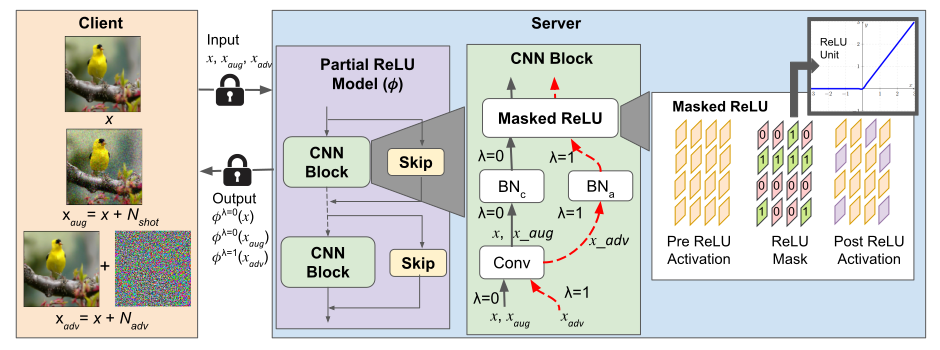

# RLNet: Robust Linearized Networks for Efficient Private Inference

## Overview
This is the Pytorch code for the paper RLNet: Robust Linearized Networks for Efficient Private Inference. This paper presents RLNet, a class of models that can yield latency improvement via the reduction of high-latency ReLU operations while improving the model performance on both clean and corrupted images. In particular, RLNet models provide a “triple win ticket” of improved classification accuracy on clean, naturally perturbed, and gradient-based perturbed images using a shared-mask shared-weight architecture with over an order of magnitude fewer ReLUs
than baseline models.

<p align="center"> 
    
</p> 

The training is performed in 3 stages: training a robust all ReLU teacher, generating a ReLU mask for achieving a target number of ReLU operations in the partial ReLU model, and finally, fine-tuning the partial ReLU model with the frozen ReLU mask.

## Usage

### Train a teacher model

```
python train_teacher.py --model='ResNet18' --dataset='cifar10' --augment_mode='augmix' --attack_mode='pgd' --use2BN
```

### Train stage-1: ReLU mask identification

Training with natural images:
```
python train_student_stage1_multigpu.py --path_t='save/models/CIFAR10/ResNet18_best.pth' --gamma=0.5 --alpha=0.5 --beta=1000 --model_s='CustomResNet18' --dataset='cifar10' --distill='kd' --sensitivity='ResNet18_C10_relu82k_sensitivity'
```
Dual-BN training:
```
CUDA_VISIBLE_DEVICES=2 python train_student_stage1_multigpu.py --path_t='save/models/ResNet18_cifar10_augmix_pgd_2BN_batch128/ResNet18_best_TA0.0.pth' --gamma=0.5 --alpha=0.5 --beta=1000 --model_s='CustomResNet18' --dataset='cifar10' --distill='kd' --sensitivity='ResNet18_c100_relu82k_sensitivity' --attack_mode='pgd' --steps=7 --kd_T=4 --robust_train_mode='rslad+ce' --augment_mode='augmix' --use2BN 
```
Multi-GPU training:
```
CUDA_VISIBLE_DEVICES=1,2 python -m torch.distributed.launch --nproc_per_node=2 --master_port=29500 train_student_stage1_multigpu.py --path_t='save/models/imagenet/ResNet18_best.pth' --gamma=0.5 --alpha=0.5 --beta=1000 --model_s='CustomResNet18' --dataset='imagenet' --distill='kd' --sensitivity='ResNet18_imagenet_relu300k_sensitivity' --t1_epochs=90 --learning_rate=0.01 --lr_decay_epochs='50,80'
```

### Train stage-2: Fine-tuning with frozen ReLU mask

Training with natural images:
```
python train_student_stage2_multigpu.py --dataset='cifar10' --path_t='save/models/CIFAR10/ResNet18_best.pth' --gamma=0.1 --alpha=0.5 --beta=1000 --model_s='CustomResNet18' --dense --distill='attention' --learning_rate=0.01 --path_s_load='save/student_model/stage1/S:CustomResNet18_T1:ResNet18_cifar10_relu82k/CustomResNet18_stage1_best.pth'
```
Dual-BN training:
```
CUDA_VISIBLE_DEVICES=1 python train_student_stage2_multigpu.py --dataset='cifar10' --path_t='save/models/ResNet18_cifar10_augmix_pgd_2BN_batch128/ResNet18_best_TA0.0.pth' --gamma=0.5 --alpha=0.5 --beta=1000 --model_s='CustomResNet18' --dense --distill='attention' --learning_rate=0.01 --path_s_load='save/student_model/stage1/S:CustomResNet18_T1:ResNet18_cifar10_relu120k_augmix_rslad+ce_kdT4.0_2BN_batch128/CustomResNet18_best_TA0.0.pth' --attack_mode='pgd' --steps=7 --kd_T=4 --augment_mode='augmix' --robust_train_mode='rslad+attn+augattn+ce' --use2BN   
```
Triple-BN Training:
```
python train_student_stage2_multigpu.py --dataset='cifar10' --path_t='save/models/ResNet18_cifar10_augmix_pgd_3BN/ResNet18_best_TA0.0.pth' --alpha=0.5 --model_s='CustomResNet18' --dense --distill='attention' --learning_rate=0.01 --path_s_load='save/student_model/stage1/S:CustomResNet18_T1:ResNet183BN_cifar10_relu82k_rslad_3BN/CustomResNet18_best_TA0.0.pth' --attack_mode='pgd' --steps=7 --kd_T=4 --robust_train_mode='rslad' --batch_size=128 --use3BN
```
Multi-GPU Training:
```
CUDA_VISIBLE_DEVICES=1,2 python -m torch.distributed.launch --master_port=29600 --nproc_per_node=2 train_student_stage2_multigpu.py --dataset='imagenet' --batch_size=256 --path_t='save/models/ResNet18_imagenet_batch_256_lr_0.05_gpu:2/ResNet18_best.pth' --gamma=0.1 --alpha=0.9 --beta=1000 --model_s='CustomResNet18' --dense --distill='attention' --learning_rate=0.01 --path_s_load='save/student_model/stage1/S:CustomResNet18_T1:ResNet18_imagenet_relu300k/CustomResNet18_stage1_best.pth'
```

### Validate against common corruptions

For all ReLU models:
```
python validate_common_corruptions.py --model=ResNet18 --path='save/models/ResNet18_cifar10_augmix_pgd_2BN_batch128/ResNet18_best_TA0.0.pth' --attack_mode='pgd' --steps=20 --validate_mode='Normal_Network' --use2BN
```
For partial ReLU models:
```
python validate_common_corruptions.py --model=CustomResNet18 --path='save/student_model/stage2/S:CustomResNet18_T1:ResNet18_stage1:senet_cifar10_relu82k_augmix_rslad+attn+augattn+ce_kdT4.0_2BN_batch128/CustomResNet18_stage2_best_TA0.0.pth' --attack_mode='pgd' --steps=20 --validate_mode='Custom_Network' --use2BN
```
## Citation
If you find this repo useful for your research, please consider citing the following work:
```
@InProceedings{sarkar_2024_CVPRW,
    author    = {Sarkar, Sreetama and Kundu, Souvik and Beerel, Peter},
    title     = {RLNet: Robust Linearized Networks for Efficient Private Inference},
    booktitle = {Proceedings of the IEEE/CVF Conference on Computer Vision and Pattern Recognition (CVPR) Workshops},
    year      = {2024}
}
```
